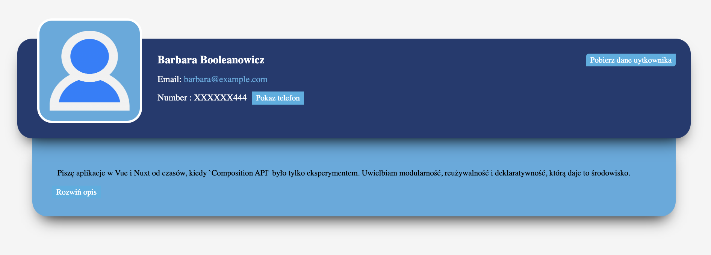

Candidate Card

Candidate Card application is used to fetch candidate data and display it in a clear form. It allows you to easily browse the list of candidates, along with their basic information. This project uses the API source https://webwizards.home.pl/jacek/frontend-task/api/user/ to get the required data.




## Netlify link

https://6847197804eccf0fbab5edbb--candidate-card.netlify.app/


## Project Setup

```bash
# Install project dependencies
npm install

# Compile and Hot-reload for Development
npm run dev

# Type-Check, Compile and Minify for Production
npm run build 
```
